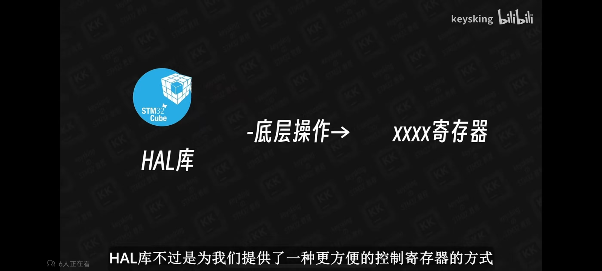
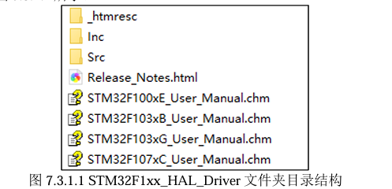
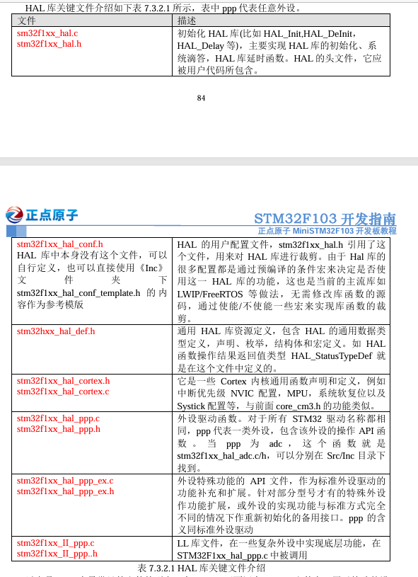
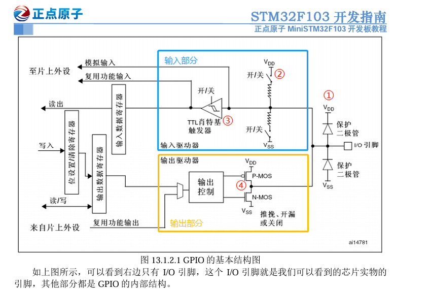
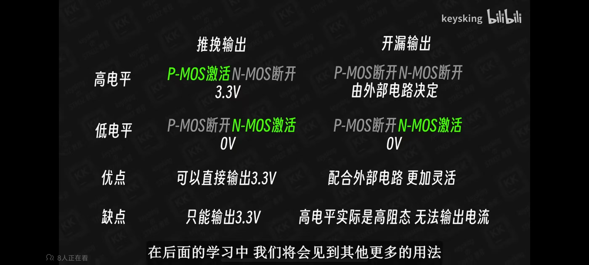
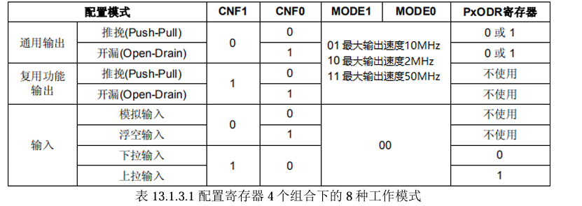
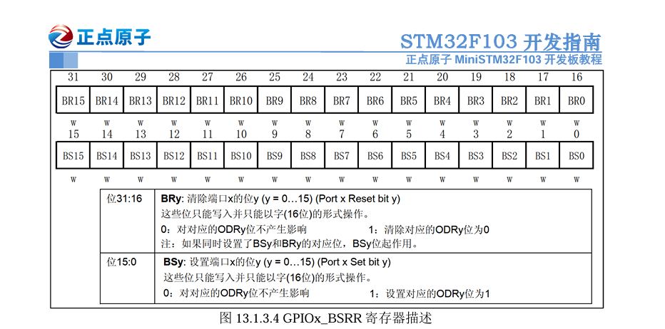

[toc]

# Lab Assignment 1

SID:12110813																																										Name:刘圣鼎

## HAL库的简介（STM32不完全手册_HAL库版本_V1.01）

其实最直观的理解，所谓的HAL库就是为我们提供了一种更方便控制寄存器的方式（引用自B站嵌入式大神keysking）



然后是来自STM32不完全手册*HAL库版本V1.01*对于HAL的介绍。

HAL，英文全称Hardware Abstraction Layer，即硬件抽象层。HAL库是 ST公司提供的外 设驱动代码的驱动库，用户只需要调用库的API函数，便可间接配置寄存器。我们要写程序 控制STM32芯片，其实最终就是控制它的寄存器，使之工作在我们需要得模式下，HAL库将 大部分寄存器得操作封装成了函数，我们只需要学习和掌握HAL库函数的结构和用法，就能 方便地驱动STM32工作，以节省开发时间。

### HAL（节选自STM32不完全手册_HAL库版本_V1.01 7.1.2）

HAL是Hardware Abstraction Layer的缩写，即硬件抽象层。是ST为可以更好的确保跨 STM32产品的最大可移植性而推出的MCU操作库。这种程序设计由于抽离应用程序和硬件底 层的操作，更加符合跨平台和多人协作开发的需要。  HAL库是基于一个非限制性的BSD许可协议（Berkeley Software Distribution）而发布的 开源代码。 ST制作的中间件堆栈（USB主机和设备库，STemWin）带有允许轻松重用的许可 模式， 只要是在ST公司的MCU 芯片上使用，库中的中间件(USB 主机/设备库,STemWin)协 议栈即被允许修改，并可以反复使用。至于基于其它著名的开源解决方案商的中间件 （FreeRTOS，FatFs，LwIP和PolarSSL）也都具有友好的用户许可条款。  HAL库是从ST公司从自身芯片的整个生产生态出发，为了方便维护而作的一次整合，以 改变标准外设库带来各系列芯片操作函数结构差异大、分化大、不利于跨系列移植的情况。相 比标准外设库，STM32Cube HAL库表现出更高的抽象整合水平，HAL库的API集中关注各外 设的公共函数功能，这样便于定义一套通用的用户友好的API函数接口，从而可以轻松实现 从一个STM32产品移植到另一个不同的STM32系列产品。但由于封闭函数为了适应最大的兼 容性，HAL库的一些代码实际上的执行效率要远低于寄存器操作。但即便如此，HAL库仍是 ST未来主推的库。  

### HAL库能做什么（节选自STM32不完全手册_HAL库版本_V1.01 7.1.3）

用过标准库的朋友应该知道，使用标准库可以忽略很多芯片寄存器的细节，根据提供的接口函数快速配置和使用一个STM32芯片，使用HAL库也是如此。不论何种库，本质都是配置 指定寄存器使芯片工作在我们需要的工作模式下。HAL 库在设计的时候会更注重软硬件分离。 **HAL 库的 API集中关注各个外设的公共函数功能，便于定义通用性更好、更友好的 API函数 接口，从而具有更好的可移植性**。HAL库写的代码在不同的STM32产品上移植，非常方便。  我们需要学会调用HAL库的API函数，配置对应外设按照我们的要求工作，这就是HAL 库能做的事。但是无论库封装得多高级，最终还是要通过配置寄存器来实现。所以我们学习 HAL 库的同时，也建议同时学习外设的工作原理和寄存器的配置。只有掌握了原理，才能更 好的使用HAL库，一旦发生问题也能更快速了定位和解决问题。  HAL 库还可以和 STM32CubeMX（图形化软件配置工具）配套一起使用，开发者可以使 用该工具进行可视化配置，并且自动生成配置好的初始化代码，大大的节省开发时间。 


###  HAL库框架结构（节选自STM32不完全手册_HAL库版本_V1.01 7.3）

这一小节我们简要分析一下HAL驱动文件夹下的驱动文件，帮助大家快速认识HAL库驱 动的构成，旨在帮大家快速认识HAL库的函数的一些常用形式，帮助大家遇到HAL库时能根 据名字大致推断该函数的用法，本部分不要求大家在学习完本节后完全记住。

**7.3.1 HAL库文件夹结构** 



**7.3.2 HAL库文件介绍** 



**对于HAL的API函数**，常见的有以下几种：  

• 初始化/反初始化函数：HAL_PPP_Init()，HAL_PPP_DeInit()  

• 外设读写函数：HAL_PPP_Read()，HAL_PPP_Write()，HAL_PPP_Transmit()， HAL_PPP_Receive()  

• 控制函数：HAL_PPP_Set ()，HAL_PPP_Get ()  

• 状态和错误：HAL_PPP_GetState ()，HAL_PPP_GetError ()  

HAL库封装的很多函数都是通过定义好的结构体将参数一次性传给所需函数，参数也有 一定的规律，主要有以下三种：  

• 配置和初始化用的结构体  一般为PPP_InitTypeDef或PPP_ ConfTypeDef的结构体类型，根据外设的寄存器设计成易 于理解和记忆的结构体成员。

• 特殊处理的结构体  专为不同外设而设置的，带有“Process”的字样，实现一些特异化的中间处理操作等。  

• 外设句柄结构体 

## GPIO定义的全部API函数分析（stm32f1xx_ll_gpio.h、stm32f1xx_hal_gpio.h、stm32f1xx_hal_gpio.c、stm32f1xx_hal_gpio_ex.h、GPT 4o）


### 理解GPIO的基本结构（参考自STM32F103开发指南）

GPIO功能模式  GPIO有八种工作模式，分别是：  

1、输入浮空  2、输入上拉  3、输入下拉  4、模拟输入  5、开漏输出  6、推挽输出  7、开漏式复用功能  8、推挽式复用功能 

我们知道了GPIO有八种工作模式，具体这些模式是怎么实现的？下面我们通过GPIO的 基本结构图来分别进行详细分析，先看看总的框图



### 理解GPIO的控制原理（参考自https://b23.tv/qAGTqEn）

首先来看输入驱动器

在图中可以看到被输出控制模块控制的两个MOS，分别是P-MOS和N-MOS，其作用可以简化为两个被控制的开关，VDD是指3.3V的高电平，VSS是指0V的低电平

STM32的输出模式分为两类，推挽输出和开漏输出

我们先假设I/O口连接了一个普通小灯，小灯的另一端是GND，倘若小灯的工作电压为3.3V，则我们可以使用推挽输出模式，此模式下P-MOS和N-MOS协同工作，当我们使用HAL_GPIO_WritePin函数控制此I/O口输出高电平，函数内部对相关寄存器的数据进行了修改，导致P-MOS激活，N-MOS关闭，此时VDD与I/O引脚连通，电流形成，小灯亮起

而当我们控制I/O口输出低电平时，则正好相反P-MOS关闭，N-MOS激活，此时VSS与I/O引脚连通，没有电流产生，小灯熄灭。这就是推挽输出的工作方式。

其具有一定的电压与电流驱动能力，可以直接驱动一些合适的元件工作

但是总有一些元件需要更高或者更低的电压来驱动

例如，倘若小灯的工作电压是5V，则由推挽输出提供的3.3V高电平就无法正常将其驱动，此时就是开漏输出的用武之地

开漏模式下只有N-MOS工作，P-MOS一直处于断开状态，使用HAL_GPIO_WritePin函数控制此I/O口输出高电平，则N-MOS断开，整个I/O口内部处于高阻态或者说“断路”，，并不对外输出特定的电平信号，电路断路，小灯也就不会亮起，若控制I/0口输出低电平，则N-MOS激活，I/O引脚与VSS连接，小灯两端都是0V，也不会亮起。但倘若我们将小灯的GND改成来自外部的5V，则此时电压差形成，电流形成，小灯亮起，而再让I/O口输出高电平，也就是N-MOS断开，依旧形成断路，无法形成电流，小灯熄灭。

可以注意到推挽输出时小灯是由来自芯片的电压所驱动，但开漏输出却并没有驱动能力，必须依靠外部的电压源来驱动，这是其确定，但也因此而拥有了最大的优点：更加灵活



对于输出控制模块，它有两个控制指令的来源

- 一个是我们使用HAL_GPIO_WritePin函数控制的输出寄存器
- 另一个是片上外设，例如串口模块和$I^2C$模块

因此STM32将两种输出模式又细分为了

- 普通的推挽输出与开漏输出
- 复用推挽输出与开漏输出

至此，我们就完成了对输出驱动器的了解

输入驱动器

首先经过上拉和下拉两个电阻

- 当上拉输入时，上方电阻启动
- 当下拉输入时，下方电阻启动
- 浮空输入时，两个电阻都不会启用

与开漏输出类似，可以依赖外部的电路实现更多的可能性

施密特触发器：稳定电平

最后经过施密特触发器处理后的电平信号被写入输入数据寄存器

等待我们使用HAL_GPIO_ReadPin函数对寄存器进行读取

这就是最基本的GPIO口读取高低电平的原理

除此之外，注意到有两个分支

- 模拟输入
- 复用功能输入

浮空，上拉，下拉这三种输入模式都是仅读取了高低电平，也就是所谓的数字信号，因此统称为数字输入

而模拟输入却是读取输入电压的具体数值，因而在施密特触发器前便产生了分支，将输入电压引入到了模拟输入相关的片上外设（与ADC相关）

而另一条支线则是在施密特触发器后接入了例如串口模块等需要数字输入的片上外设

不过与输出部分只能有一个控制源不同的是，输入部分的不同分支可以同时读取施密特触发器的输出，也就没有复用上下拉的模式

至此，我们就完成了对输入驱动器的了解


### HAL库中全部GPIO函数定义，GPIO_Port，GPIO_Pin结构体定义 (stm32f1xx_hal_gpio.h)

下面是在HAL库中定义的关于GPIO的全部函数，GPIO_Port结构体的定义和GPIO_Pin的结构体定义

```c
void HAL_GPIO_Init(GPIO_TypeDef *GPIOx, GPIO_InitTypeDef *GPIO_Init);
void HAL_GPIO_DeInit(GPIO_TypeDef *GPIOx, uint32_t GPIO_Pin);
GPIO_PinState HAL_GPIO_ReadPin(GPIO_TypeDef* GPIOx, uint16_t GPIO_Pin);
void HAL_GPIO_WritePin(GPIO_TypeDef* GPIOx, uint16_t GPIO_Pin, GPIO_PinState PinState);
void HAL_GPIO_TogglePin(GPIO_TypeDef* GPIOx, uint16_t GPIO_Pin);
HAL_StatusTypeDef HAL_GPIO_LockPin(GPIO_TypeDef* GPIOx, uint16_t GPIO_Pin);
void HAL_GPIO_EXTI_IRQHandler(uint16_t GPIO_Pin);
void HAL_GPIO_EXTI_Callback(uint16_t GPIO_Pin);
```

```C
typedef struct
{
  uint32_t Pin;       /*!<   选择引脚
                           */

  uint32_t Mode;      /*!< 设置引脚模式
                            */

  uint32_t Pull;      /*!< 引脚是否上拉或下拉
                           */

  uint32_t Speed;     /*!< 设置引脚速度
                            */
} GPIO_InitTypeDef;


```

```C
typedef struct
{
  __IO uint32_t CRL;
  __IO uint32_t CRH;
  __IO uint32_t IDR;
  __IO uint32_t ODR;
  __IO uint32_t BSRR;
  __IO uint32_t BRR;
  __IO uint32_t LCKR;
} GPIO_TypeDef;
```

接下来，我们对HAL库的每一个GPIO函数逐一进行分析（因为里面涉及到一些还没学到的知识，比如EXIT，LockPin等，所以在对看不懂的部分我在分析的过程中我使用了GPT的力量）。

### HAL_GPIO_Init() 函数代码分析(stm32f1xx_hal_gpio.c)

`HAL_GPIO_Init()` 函数用于初始化STM32的GPIO引脚，配置其工作模式、输出类型、上拉/下拉电阻等。

#### 1. 参数检查

```C
assert_param(IS_GPIO_ALL_INSTANCE(GPIOx));
assert_param(IS_GPIO_PIN(GPIO_Init->Pin));
assert_param(IS_GPIO_MODE(GPIO_Init->Mode));
```
通过宏 `assert_param` 检查输入参数的有效性，确保传入的GPIO端口、引脚和模式是有效的。

#### 2. GPIO引脚配置循环

```c
while (((GPIO_Init->Pin) >> position) != 0x00u)
```
循环遍历`GPIO_Init->Pin`中的每一位，以确定需要配置的引脚。

#### 3. 获取当前引脚位置信息

```c
ioposition = (0x01uL << position);
iocurrent = (uint32_t)(GPIO_Init->Pin) & ioposition;
if (iocurrent == ioposition)
```
`ioposition`指向当前正在处理的引脚的第几位，`iocurrent`用于检查该引脚是否被选中。

如果未被选择，则继续遍历其他引脚

```C
position++;
```

如果被选中则进入以下的代码部分

#### 4. 配置引脚模式和类型

根据`GPIO_Init->Mode`的不同值，函数决定如何设置寄存器。以下是不同模式的设置分析：

```C
#ifdef HAL_GPIO_MODULE_ENABLED

/* Private typedef -----------------------------------------------------------*/
/* Private define ------------------------------------------------------------*/
/** @addtogroup GPIO_Private_Constants GPIO Private Constants
  * @{
  */
#define GPIO_MODE             0x00000003u
#define EXTI_MODE             0x10000000u
#define GPIO_MODE_IT          0x00010000u
#define GPIO_MODE_EVT         0x00020000u
#define RISING_EDGE           0x00100000u
#define FALLING_EDGE          0x00200000u
#define GPIO_OUTPUT_TYPE      0x00000010u

#define GPIO_NUMBER           16u

/* Definitions for bit manipulation of CRL and CRH register */
#define  GPIO_CR_MODE_INPUT         0x00000000u /*!< 00: Input mode (reset state)  */
#define  GPIO_CR_CNF_ANALOG         0x00000000u /*!< 00: Analog mode  */
#define  GPIO_CR_CNF_INPUT_FLOATING 0x00000004u /*!< 01: Floating input (reset state)  */
#define  GPIO_CR_CNF_INPUT_PU_PD    0x00000008u /*!< 10: Input with pull-up / pull-down  */
#define  GPIO_CR_CNF_GP_OUTPUT_PP   0x00000000u /*!< 00: General purpose output push-pull  */
#define  GPIO_CR_CNF_GP_OUTPUT_OD   0x00000004u /*!< 01: General purpose output Open-drain  */
#define  GPIO_CR_CNF_AF_OUTPUT_PP   0x00000008u /*!< 10: Alternate function output Push-pull  */
#define  GPIO_CR_CNF_AF_OUTPUT_OD   0x0000000Cu /*!< 11: Alternate function output Open-drain  */
```



- **输出模式（推挽和开漏）**：
  
  ```c
  case GPIO_MODE_OUTPUT_PP:
      config = GPIO_Init->Speed + GPIO_CR_CNF_GP_OUTPUT_PP;
  ```
  - **寄存器设置**：将引脚配置为推挽输出，设置速度和模式位。
  
- **输入模式**：
  
  ```c
  case GPIO_MODE_INPUT:
  ```
  - **寄存器设置**：根据上拉/下拉电阻选择，将引脚设置为输入模式，并在必要时设置输出数据寄存器（ODR）的位。
  
- **模拟模式**：
  ```c
  case GPIO_MODE_ANALOG:
      config = GPIO_CR_MODE_INPUT + GPIO_CR_CNF_ANALOG;
  ```
  - **寄存器设置**：将引脚配置为模拟输入，禁止数字输入。

#### 5. 确定CRL或CRH寄存器

```c
configregister = (iocurrent < GPIO_PIN_8) ? &GPIOx->CRL : &GPIOx->CRH;
registeroffset = (iocurrent < GPIO_PIN_8) ? (position << 2u) : ((position - 8u) << 2u);
```
根据引脚编号决定使用CRL（0-7号引脚）或CRH（8-15号引脚）寄存器，并计算对应引脚在寄存器中的偏移量。

#### 6. 应用配置到寄存器

```c
MODIFY_REG((*configregister), ((GPIO_CRL_MODE0 | GPIO_CRL_CNF0) << registeroffset), (config << registeroffset));
```
通过`MODIFY_REG`宏将计算出的配置应用到相应的寄存器中，确保引脚的工作模式和类型被正确设置。

#### 7. 外部中断或事件配置（GPT 4o）

```c
if ((GPIO_Init->Mode & EXTI_MODE) == EXTI_MODE)
```
如果引脚配置为外部中断或事件，进一步设置外部中断控制寄存器（EXTI）以启用相应的中断和事件功能。

**具体设置**：

- **AFIO时钟使能**：启用AFIO时钟以支持外部中断。
- **EXTI触发设置**：配置上升沿和下降沿触发条件。
- **中断和事件掩码**：根据需要启用或禁用中断和事件。

`HAL_GPIO_Init()`函数通过对GPIO引脚进行逐一配置，确保它们能按照用户设定的模式和类型正常工作。

### HAL_GPIO_DeInit() 函数代码分析(stm32f1xx_hal_gpio.c)

`HAL_GPIO_DeInit()` 函数用于反初始化STM32的GPIO引脚，将其**设置回默认状态**。这对释放资源和避免潜在的干扰非常重要。

#### 1. 参数检查

```c
assert_param(IS_GPIO_ALL_INSTANCE(GPIOx));
assert_param(IS_GPIO_PIN(GPIO_Pin));
```
通过宏 `assert_param` 检查输入参数的有效性，确保传入的GPIO端口和引脚是有效的。

#### 2. GPIO引脚配置循环
```c
while ((GPIO_Pin >> position) != 0u)
```
循环遍历`GPIO_Pin`中的每一位，以确定需要反初始化的引脚。

#### 3. 获取当前引脚位置信息
```c
iocurrent = (GPIO_Pin) & (1uL << position);
```
`iocurrent`表示当前正在处理的引脚，如果该引脚被选中，则`iocurrent`将非零。

#### 4. 外部中断或事件配置清除(GPT 4o)

```c
tmp = AFIO->EXTICR[position >> 2u];
tmp &= 0x0FuL << (4u * (position & 0x03u));
```
检查当前引脚是否配置为外部中断或事件。

**寄存器设置**：

- **清除中断配置**：通过调用`CLEAR_BIT`宏，禁用相关的中断和事件掩码。
- **清除触发边缘配置**：移除上升沿和下降沿触发设置。
- **清除EXTI线路配置**：将对应的EXTI配置寄存器位重置为默认值。

#### 5. GPIO模式配置清除
```c
configregister = (iocurrent < GPIO_PIN_8) ? &GPIOx->CRL : &GPIOx->CRH;
registeroffset = (iocurrent < GPIO_PIN_8) ? (position << 2u) : ((position - 8u) << 2u);
```
根据引脚编号决定使用CRL（0-7号引脚）或CRH（8-15号引脚）寄存器，并计算偏移量。

#### 6. 应用默认配置到寄存器
```c
MODIFY_REG(*configregister, ((GPIO_CRL_MODE0 | GPIO_CRL_CNF0) << registeroffset), GPIO_CRL_CNF0_0 << registeroffset);
```
通过`MODIFY_REG`宏将引脚配置为默认状态（浮动输入模式），即清除输出模式和配置位。这确保引脚在反初始化后不会影响后续的操作。

#### 7. 清除输出数据寄存器（ODR）
```c
CLEAR_BIT(GPIOx->ODR, iocurrent);
```
将对应引脚的输出数据寄存器位清零，确保引脚不再驱动任何信号。

```c
/**
  * @brief  Reads the specified input port pin.
  * @param  GPIOx: where x can be (A..G depending on device used) to select the GPIO peripheral
  * @param  GPIO_Pin: specifies the port bit to read.
  *         This parameter can be GPIO_PIN_x where x can be (0..15).
  * @retval The input port pin value.
  */
GPIO_PinState HAL_GPIO_ReadPin(GPIO_TypeDef *GPIOx, uint16_t GPIO_Pin)
{
  GPIO_PinState bitstatus;

  /* Check the parameters */
  assert_param(IS_GPIO_PIN(GPIO_Pin));

  if ((GPIOx->IDR & GPIO_Pin) != (uint32_t)GPIO_PIN_RESET)
  {
    bitstatus = GPIO_PIN_SET;
  }
  else
  {
    bitstatus = GPIO_PIN_RESET;
  }
  return bitstatus;
}

```

`HAL_GPIO_DeInit()`函数通过逐一清除GPIO引脚的配置，确保其恢复到默认状态。函数中对寄存器的设置有效地释放了资源，避免了潜在的干扰和冲突。


### HAL_GPIO_ReadPin() 和 HAL_GPIO_WritePin() 函数分析

这两个函数分别用于读取和写入GPIO引脚的状态。

#### HAL_GPIO_ReadPin() (stm32f1xx_hal_gpio.c)

```c
GPIO_PinState HAL_GPIO_ReadPin(GPIO_TypeDef *GPIOx, uint16_t GPIO_Pin)
```

- **功能**：读取指定GPIO端口引脚的输入状态。
- **参数**：
  - `GPIOx`：选择的GPIO外设（例如：GPIOA、GPIOB等）。
  - `GPIO_Pin`：要读取的引脚编号（0-15）。

- **返回值**：返回该引脚的状态，可能的值为`GPIO_PIN_SET`或`GPIO_PIN_RESET`。

- **代码分析**：
  ```c
  if ((GPIOx->IDR & GPIO_Pin) != (uint32_t)GPIO_PIN_RESET)
  {
    bitstatus = GPIO_PIN_SET;
  }
  else
  {
    bitstatus = GPIO_PIN_RESET;
  }
  return bitstatus;
  ```
  - 读取输入数据寄存器（IDR）并检查特定位（对应于`GPIO_Pin`）是否为高电平。
  - 如果该位为高电平，则返回`GPIO_PIN_SET`，否则返回`GPIO_PIN_RESET`。

HAL_GPIO_ReadPin()函数提供了简单的接口去读取GPIO引脚。

在我看来, HAL_GPIO_ReadPin()本质上是在读取特定的PORT的IDR寄存器，从而得到该PORT的特定PIN的输入数据。

#### BSRR寄存器（STM32F103 MINI开发指南V1.3）



#### BSRR寄存器的工作原理

BSRR（Bit Set/Reset Register）寄存器是STM32微控制器中用于控制GPIO引脚的一个特殊寄存器。它的主要功能是通过单个操作设置或清除GPIO引脚的状态，从而实现原子性操作，避免在读/写操作之间可能发生的中断。

为什么有了ODR寄存器，还要这个BSRR寄存器呢？我们先看看BSRR的寄存器描述， 首先 BSRR 是只写权限，而 ODR 是可读可写权限。BSRR 寄存器 32 位有效，对于低 16位 （0-15），我们往相应的位写 1(BSy=1)，那么对应的 IO 口会输出高电平，往相应的位写 0(BSy=0)，对 IO 口没有任何影响，高 16位（16-31）作用刚好相反，对相应的位写 1(BRy=1) 会输出低电平，写0(BRy=0)没有任何影响，y=0~15。  也就是说，对于BSRR寄存器，你写0的话，对IO口电平是没有任何影响的。我们要设置某个IO口电平，只需要相关位设置为1即可。

而ODR寄存器，我们要设置某个IO口电平， 我们首先需要读出来ODR寄存器的值，然后对整个ODR寄存器重新赋值来达到设置某个或 者某些IO口的目的，而BSRR寄存器直接设置即可，这在多任务实时操作系统中作用很大。 BSRR寄存器还有一个好处，就是BSRR寄存器改变引脚状态的时候，不会被中断打断，而 ODR寄存器有被中断打断的风险。 

#### BSRR寄存器的优点

1. **原子性操作**：因为BSRR只写不读，所以通过BSRR寄存器进行的设置和清除操作是原子的，这意味着在执行这些操作时，不会受到中断的干扰。
2. **效率**：通过BSRR寄存器可以在一次操作中设置或清除多个引脚，减少了对GPIO外设寄存器的访问次数，提高了效率。
3. **简洁性**：使用BSRR寄存器进行引脚状态控制使得代码更为简洁、易读，避免了复杂的位操作和条件判断。

#### HAL_GPIO_WritePin() (stm32f1xx_hal_gpio.c)

```c
void HAL_GPIO_WritePin(GPIO_TypeDef *GPIOx, uint16_t GPIO_Pin, GPIO_PinState PinState)
```

- **功能**：设置或清除指定GPIO引脚的数据状态。
- **参数**：
  - `GPIOx`：选择的GPIO外设。
  - `GPIO_Pin`：要写入的引脚编号（0-15）。
  - `PinState`：要写入的状态，可以是`GPIO_PIN_SET`（设置引脚为高电平）或`GPIO_PIN_RESET`（设置引脚为低电平）。

- **代码分析**：
  
  ```c
  if (PinState != GPIO_PIN_RESET)
  {
    GPIOx->BSRR = GPIO_Pin;
  }
  else
  {
    GPIOx->BSRR = (uint32_t)GPIO_Pin << 16u;
  }
  ```
  - 使用BSRR寄存器进行设置或清除引脚。BSRR寄存器的特性是允许原子操作，避免在读/写操作之间发生中断。
  - 如果`PinState`为`GPIO_PIN_SET`，则直接将引脚编号写入BSRR寄存器以设置该引脚。
  - 如果`PinState`为`GPIO_PIN_RESET`，则将引脚编号左移16位后写入BSRR寄存器，以清除该引脚。

在我看来, HAL_GPIO_WritePin() 本质上是通过使用BSRR寄存器，提供了简单的接口来写入GPIO引脚的状态，并确保了操作的原子性和有效性。。

### HAL_GPIO_TogglePin() 和 HAL_GPIO_LockPin() 函数分析

这两个函数分别用于切换GPIO引脚的状态和锁定GPIO引脚的配置。以下是对这两个函数的详细分析。

#### HAL_GPIO_TogglePin() (stm32f1xx_hal_gpio.c)

```c
void HAL_GPIO_TogglePin(GPIO_TypeDef *GPIOx, uint16_t GPIO_Pin)
```

- **功能**：切换指定的GPIO引脚状态，即如果引脚为高电平则设置为低电平，反之亦然。
- **参数**：
  - `GPIOx`：选择的GPIO外设（例如：GPIOA、GPIOB等）。
  - `GPIO_Pin`：要切换的引脚编号（0-15）。

- **寄存器设置分析**：
  
  ```c
  odr = GPIOx->ODR;
  GPIOx->BSRR = ((odr & GPIO_Pin) << GPIO_NUMBER) | (~odr & GPIO_Pin);
  ```
  - 首先，读取当前的输出数据寄存器（ODR）的值。
  - 使用位操作计算出需要切换的引脚状态：
    - `(odr & GPIO_Pin) << GPIO_NUMBER`：获取当前为高电平的引脚，左移以准备清除它们。
    - `(~odr & GPIO_Pin)`：获取当前为低电平的引脚。
  - 将两者相加写入BSRR寄存器，实现切换效果。

**HAL_GPIO_TogglePin()**提供了一个简单的方法来切换GPIO引脚的状态，通过使用BSRR寄存器实现高效的原子操作。

#### HAL_GPIO_LockPin() (stm32f1xx_hal_gpio.c、GPT 4o)

```c
HAL_StatusTypeDef HAL_GPIO_LockPin(GPIO_TypeDef *GPIOx, uint16_t GPIO_Pin)
```

- **功能**：锁定指定的GPIO引脚配置，使其在系统重启之前无法被修改。
- **参数**：
  
  - `GPIOx`：选择的GPIO外设。
  - `GPIO_Pin`：要锁定的引脚编号，可以是任意组合的GPIO_PIN_x。
  
- **寄存器设置分析**：
  
  ```c
  SET_BIT(tmp, GPIO_Pin);
  GPIOx->LCKR = tmp;
  GPIOx->LCKR = GPIO_Pin;
  GPIOx->LCKR = tmp;
  tmp = GPIOx->LCKR;
    if ((uint32_t)(GPIOx->LCKR & GPIO_LCKR_LCKK))
    {
      return HAL_OK;
    }
    else
    {
      return HAL_ERROR;
    }
  ```
  - 构造锁定序列，先设置锁定位，然后按顺序写入锁定寄存器（LCKR）。
  - 最后读取LCKR寄存器以完成锁定过程。
  - 检查锁定状态，如果成功锁定，则返回`HAL_OK`，否则返回`HAL_ERROR`。


**HAL_GPIO_LockPin()**：确保引脚配置在锁定后无法被修改，提高了安全性，适合用于保护关键引脚的配置。


### HAL_GPIO_EXTI_IRQHandler() 和 HAL_GPIO_EXTI_Callback() 函数分析

这两个函数主要用于处理外部中断（EXTI）的请求，允许用户响应GPIO引脚的状态变化。以下是对这两个函数的详细分析。

#### HAL_GPIO_EXTI_IRQHandler() (stm32f1xx_hal_gpio.c、GPT 4o)

`__HAL_GPIO_EXTI_GET_IT()`宏用于判断特定引脚的中断是否发生。

`__HAL_GPIO_EXTI_CLEAR_IT()`宏用于清除已经处理的中断请求，以防止同一中断再次被错误地触发。

##### `__HAL_GPIO_EXTI_GET_IT() (GPT 4o)`

```c
#define __HAL_GPIO_EXTI_GET_IT(__EXTI_LINE__) (EXTI->PR & (__EXTI_LINE__))
```

- **功能**：检查指定的EXTI线是否有中断请求。
- **参数**：`__EXTI_LINE__`表示要检查的EXTI线，通常是某个GPIO引脚对应的中断线。
- **工作原理**：
  - `EXTI->PR`：这是EXTI的中断请求寄存器（Pending Register），它包含了当前所有引脚的中断请求状态。
  - `& (__EXTI_LINE__)`：通过与操作符（&）来检查指定引脚的中断请求位是否为1。
  - 如果指定的EXTI线有中断请求，该表达式的结果非零；如果没有中断请求，结果为零。

#####  `__HAL_GPIO_EXTI_CLEAR_IT() (GPT 4o)`

```c
#define __HAL_GPIO_EXTI_CLEAR_IT(__EXTI_LINE__) (EXTI->PR = (__EXTI_LINE__))
```

- **功能**：清除指定的EXTI线的中断请求标志。
- **参数**：`__EXTI_LINE__`表示要清除的EXTI线。
- **工作原理**：
  - 通过将指定的引脚编号写入`EXTI->PR`寄存器来清除对应的中断请求标志。
  - 在STM32的设计中，写入1到中断请求寄存器的某一位会清除该位，即标志位被重置为0。
  - 

```c
void HAL_GPIO_EXTI_IRQHandler(uint16_t GPIO_Pin)
```

- **功能**：处理EXTI中断请求。
- **参数**：
  - `GPIO_Pin`：指定与EXTI线连接的引脚编号。

- **代码分析**：
  ```c
  #define __HAL_GPIO_EXTI_GET_IT(__EXTI_LINE__) (EXTI->PR & (__EXTI_LINE__))
  #define __HAL_GPIO_EXTI_CLEAR_IT(__EXTI_LINE__) (EXTI->PR = (__EXTI_LINE__))
  
  if (__HAL_GPIO_EXTI_GET_IT(GPIO_Pin) != 0x00u)
  {
    __HAL_GPIO_EXTI_CLEAR_IT(GPIO_Pin);
    HAL_GPIO_EXTI_Callback(GPIO_Pin);
  }
  
  ```
  - 首先，通过`__HAL_GPIO_EXTI_GET_IT()`宏检查指定的引脚是否有中断请求。
  - 如果有中断请求，调用`__HAL_GPIO_EXTI_CLEAR_IT()`清除中断标志，避免重复处理。
  - 最后，调用`HAL_GPIO_EXTI_Callback()`函数，用户可以在此回调中实现具体的中断处理逻辑。

**HAL_GPIO_EXTI_IRQHandler()**：提供了中断请求的基本处理框架，确保在中断发生时能正确清除标志并调用回调函数。

#### HAL_GPIO_EXTI_Callback() (stm32f1xx_hal_gpio.c)

```c
__weak void HAL_GPIO_EXTI_Callback(uint16_t GPIO_Pin)
```

- **功能**：EXTI中断的回调函数，允许用户自定义处理逻辑。
- **参数**：
  
  - `GPIO_Pin`：指定与EXTI线连接的引脚编号。
  
- **代码分析**：
  
  ```c
  UNUSED(GPIO_Pin);
  ```
  - 这是一个弱链接函数，允许用户在自己的代码中重写该函数，以实现特定的中断处理逻辑。
  - `UNUSED(GPIO_Pin)`用于避免未使用参数引起的编译警告。

**HAL_GPIO_EXTI_Callback()**：提供了一个可定制的回调机制，用户可以根据自己的需求实现响应中断的逻辑。这种设计使得HAL库的使用更加灵活和可扩展，允许开发者根据具体应用场景进行定制。


## 使用HAL库函数的的问题以及解决

不可否认，在使用HAL库的过程中肯定会遇到各种各样的问题，但是目前因为刚刚接触嵌入式编程，所以其实能遇到的问题非常有限，所以我就举两个我在学习过程中遇到的一些问题以及我的一些解决方案。

**问题：对于MiniSTM32的GPIO的结构和不同输入输出模式的底层原理理解不够深入，例如如何看懂schematics？如何确定输入输出是什么样的配置模式？**

**解决步骤**：

- 仔细看老师的PPT
- 在课下看了B站上的网课


在做完以上两个步骤以后收益非浅！

**问题**：GPIO未按预期工作，例如输入输出状态不正确。

**解决步骤**：

- 确认`HAL_GPIO_Init()`中传入的参数正确，尤其是引脚和模式。
- 检查时钟配置，确保GPIO时钟已启用。
- 使用调试工具确认寄存器的实际状态。

在以上一些列步骤之后，最终GPIO能够按照预期进行工作。

## Reference

[1] STM32不完全手册_HAL库版本_V1.01

[2] STM32F103开发指南

[3] stm32f1xx_ll_gpio.h

[4] stm32f1xx_hal_gpio.h

[5] stm32f1xx_hal_gpio.c

[6] stm32f1xx_hal_gpio_ex.h

[7] STM32F103 MINI开发指南V1.3

[8] ChatGPT 4o模型

[9]【开漏? 推挽? 都是些什么鬼? 动画帮你一网打尽】【STM32入门教程-2024】第5集 关于STM32 GPIO内部的那些事-哔哩哔哩】 https://b23.tv/qAGTqEn
